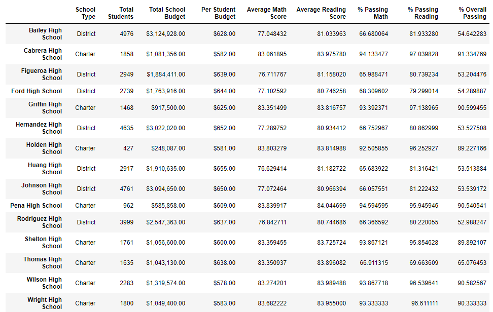
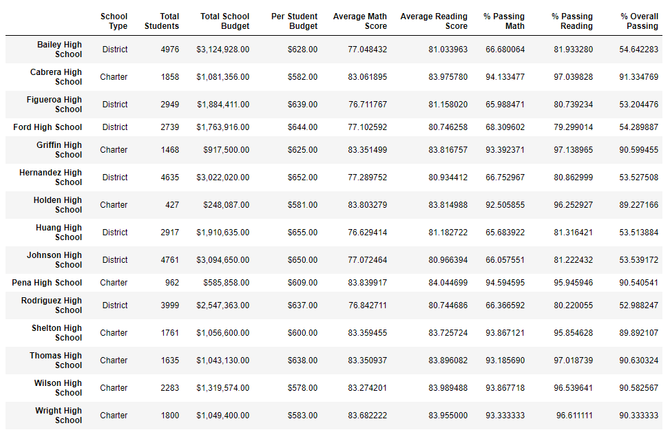
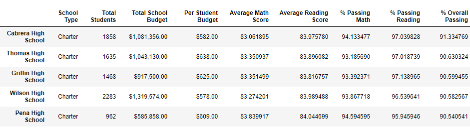
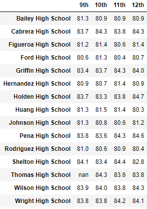
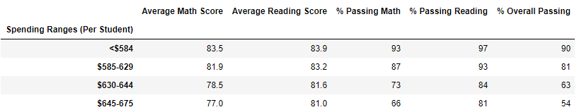
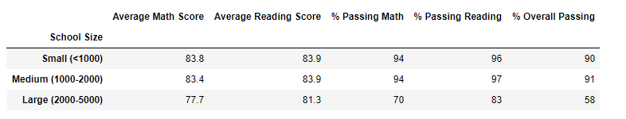
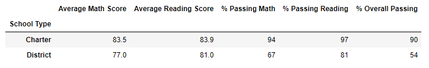

# **School District Analysis**

## **Overview of the school district analysis**

The school board reached out to say that the 9th grade math and reading scores from Thomas High School (THS) appeared to have been altered in the file we used in the school district analysis. They then asked us to replace those scores with NaNs and then repeat the school district analysis. Finally, they wanted us to describe how these changes affected the overall analysis.

## **Results**

- **District Summary Changes**
  - Changes to the district summary were fairly insignificant because 9th graders at THS only represented 1.2% of the district (461 of 39,170). For example, the percentage of students who passed math, reading, and both subjects only changed between 0.1 to 0.3%.
    - Old: Passing Math % = 75.0%; Passing Reading % = 85.8%; Passing Both = 65.2%
    - New: Passing Math % = 74.8%; Passing Reading % = 85.7%; Passing Both = 64.9%
    
    Old District Summary
    
    
    
    New District Summary
    
    
    
  
- **School Summary Changes**
  - Conversely, changes to the school summary were much more pronounced, as 9th graders at THS represented 28.2% of the school (461 of 1,635). For example, removing 9th graders scores at THS significantly improved the percentage of students who passed math, reading, and both subjects. 
    - Old: Passing Math % = 66.9%; Passing Reading % = 69.7%; Passing Both = 65.1%
    - New: Passing Math % = 93.2%; Passing Reading % = 97.0%; Passing Both = 90.6%
    
    Old School Summary
    
    
    
    New School Summary
    
    
    
- **Changes in THS performance relative to other schools**
  - Changes to the data greatly increased the performance of THS relative to other schools. Specifically, the percentage of students who passed math, reading, and both subjects all improved the relative ranking of THS compared to the other 14 schools. 
    - Old rank: Passing Math % = 9th; Passing Reading % = 15th; Passing Both = 8th
    - New Rank: Passing Math % = 7th; Passing Reading % = 3rd; Passing Both = 2nd
    
    Top 5 Schools by Overall Passing %
    
    
    
- **Replacing the ninth-grade scores also affects the following:**

  - Math and reading scores by grade: 
  
    - ....
    
    Math Scores by Grade
    
    
    
    Reading Scores by Grade
    
    
  
  - Scores by school spending: 
  
    -  After removing 9th grade scores, THS' percentage of students passing math, reading, or both subject exceeded the average rates of other schools in the same spending range per student ($630-644/student).
    
    Summary by Spending Range
    
    
    
    Spending Range (per student)
    
    
  
  - Scores by school size: 
    - Prior to removing 9th grade scores, the percentage of THS students passing math, reading, or both subjects was significantly underperforming the average rates for charter schools. After removing 9th grade scores, THS rates aligned with the averages of other medium sized schools.
    
    
  
  - Scores by school type:
    - Prior to removing 9th grade scores, the percentage of THS students passing math, reading, or both subjects was significantly underperforming the average rates for medium sized schools. After removing 9th grade scores, THS rates aligned with the averages of charter schools.
    
    

## **Four changes in the updated school district analysis**
1. The percentage of THS students who passed math increased approximately 26%.
2. The percentage of THS students who passed reading increased approximately 27%.
3. The percentage of THS students who passed both math and reading increased approximately 25%.
4. The performance of THS relative to other schools greatly improved after removing 9th grade scores. For examples, THS improved their relative ranking in the percentage of students who passed math, reading, and both subjects. 

Data Sources:
[PyCitySchools_Challenge.ipynb](PyCitySchools_Challenge.ipynb)
[schools_complete](schools_complete.csv)
[students_complete](students_complete.csv)

